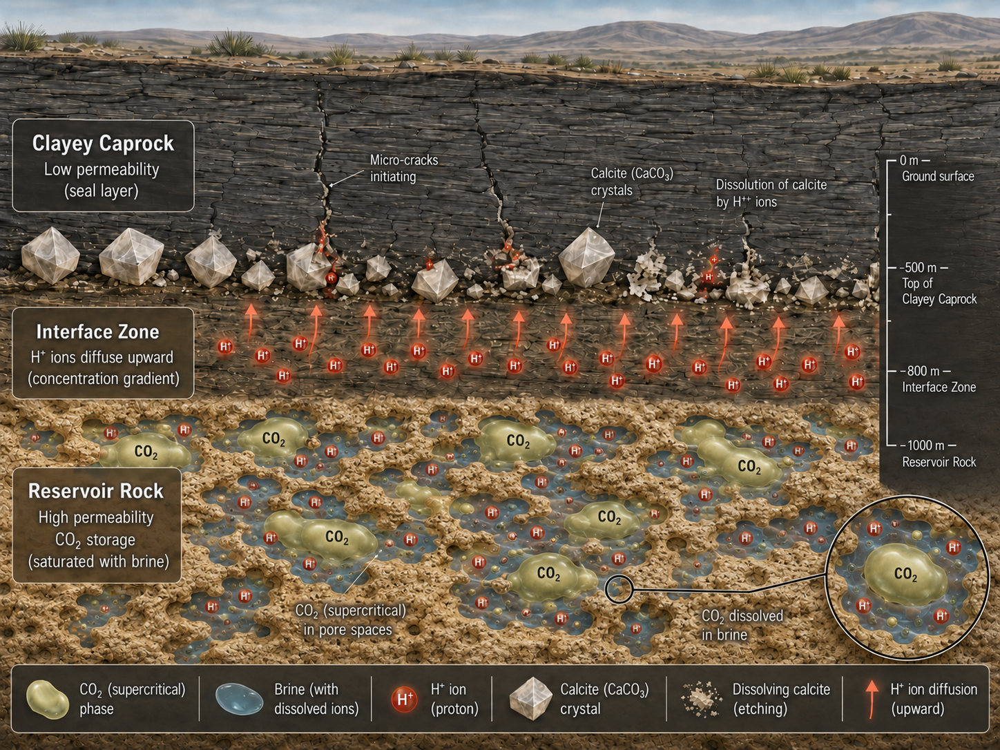
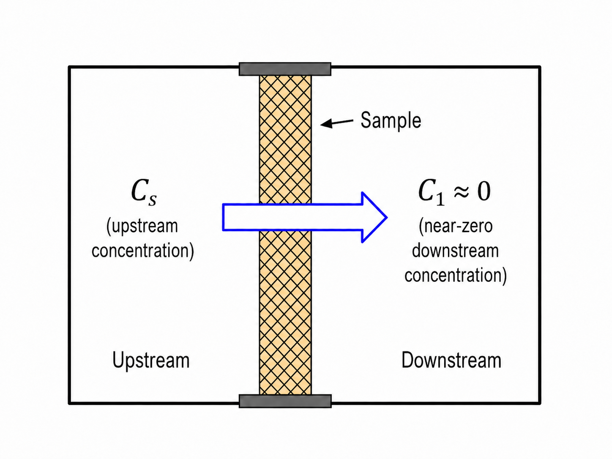
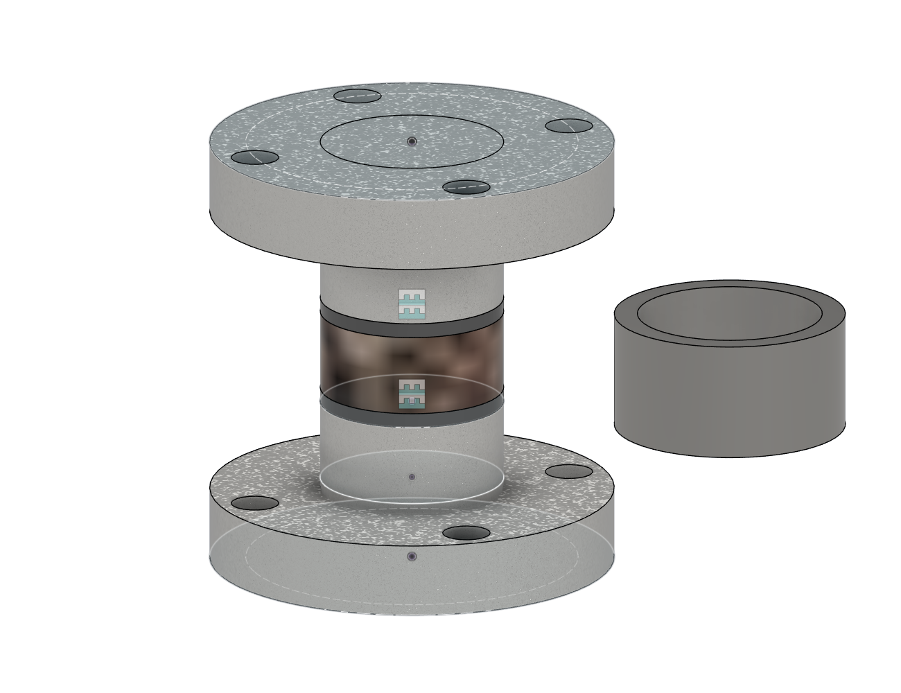

# Diffusivity of H<sup>+</sup> ions in saturated Kaolin clay: Fick's law based numerical simulation

A finite-element simulation of transient H⁺ diffusion through a saturated kaolin-clay domain coupled to two evolving external reservoirs.

> [IMPORTANT]
> **Status: simulation only. No physical through-diffusion experiment has been performed.**
>
> Every concentration field, transport rate, reservoir history, and solute amount reported in this repository is a **modeled numerical prediction**. Nothing in this repository is laboratory-measured, experimentally observed, or empirically validated.

## Project status

A working 10-hour coupled PDE–ODE simulation and post-processing workflow have been completed.

The repository currently includes:

- the final two-reservoir DOLFINx model;
- earlier numerical formulations;
- XDMF output for ParaView;
- CSV histories and selected concentration profiles;
- Matplotlib figures;
- short- and long-time numerical datasets;
- mass-balance and sign-convention diagnostics;
- poster graphics and methodology documentation.

The physical experiment represented by the model has not yet been conducted because of financial and logistical constraints. Experimental calibration and validation remain future work.

## Background

Geologic CO₂ sequestration involves injecting CO₂ into deep underground reservoirs for long-term storage. The reservoir is sealed by a low-permeability clayey caprock (kaolin clay),which prevents the injected CO₂ from migrating upward and escaping the storage formation.

When CO₂ dissolves in the reservoir brine, it forms carbonic acid, producing a solution rich in H⁺ ions. Under normal conditions, clay-rich caprocks strongly restrict fluid and solute transport. However, H⁺ ions can still slowly diffuse into the caprock, where they react with carbonate minerals such as calcite. Over time, this reaction can weaken the caprock's sealing capacity. Quantifying how fast H⁺ ions diffuse through the caprock's clay matrix is therefore essential for predicting the long-term risk of CO₂ leakage.

## Problem Setup

This project models an idealized through-diffusion experiment: a saturated kaolin-clay specimen separates two well-mixed reservoirs. The upstream reservoir initially contains H⁺ ions at a known concentration; the downstream reservoir initially contains none.




## Objectives

The computational framework aims to predict:

- the transient H⁺ concentration profile within the clay;
- the molar transport rate (flux) at each reservoir–clay interface;
- the time evolution of H⁺ concentration in both reservoirs;
- the total solute inventory of the system, as a check on mass conservation;
- the system's approach toward a long-term, near-equilibrium concentration profile.

## Model Scope

The current model captures purely diffusive transport. It does not yet include chemical reaction, mineral dissolution, pH buffering, electrostatic coupling, or transport parameters calibrated against experimental data.

## Methodology overview

### Governing equations

The clay domain is idealized as a two-dimensional rectangle with a specified out-of-plane thickness. Within the clay, the H⁺ concentration $C$ satisfies the diffusion equation

$$
\phi \frac{\partial C}{\partial t}
=
\nabla \cdot \left(D_{\mathrm{eff}}\nabla C\right),
$$

where $\phi$ is the porosity and $D_{\mathrm{eff}}$ is the effective diffusion coefficient. The corresponding Fickian flux is

$$
\mathbf{J}=-D_{\mathrm{eff}}\nabla C.
$$

### Reservoir coupling

The concentrations at the clay's two boundaries are set by well-mixed upstream and downstream reservoirs, with concentrations $C_1, C_2$ and volumes $V_1, V_2$ respectively. Each reservoir concentration evolves in response to the solute flux crossing its interface with the clay, where $\mathbf{n}$ is the outward unit normal to that interface:

$$
V_1\frac{dC_1(t)}{dt} = \dot{N_1}=B\int \mathbf{J}_1 \cdot \mathbf{n}\, ds,
\qquad
V_2\frac{dC_2(t)}{dt} = \dot{N_2}= B\int \mathbf{J}_2 \cdot \mathbf{n}\, ds.
$$

### Numerical implementation

At each time step, the diffusion PDE and the two reservoir ODEs are coupled through a fixed-point iteration. Spatially, the PDE is discretized using first-order Lagrange finite elements; in time, it is integrated with an implicit backward Euler scheme. The reservoir ODEs are integrated separately using SciPy's explicit, adaptive RK23 solver.

See [docs/METHODOLOGY.md](docs/METHODOLOGY.md) for the complete formulation, assumptions, units, numerical settings, and validation status.

## Repository structure

```text
src/            Final and archived numerical models
results/        Figures, field files, and numerical tables
validation/     Mass, sign, and time-step checks
docs/           Detailed technical documentation and poster material
```